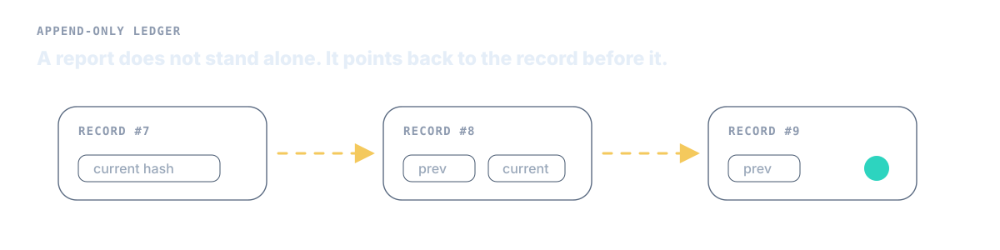
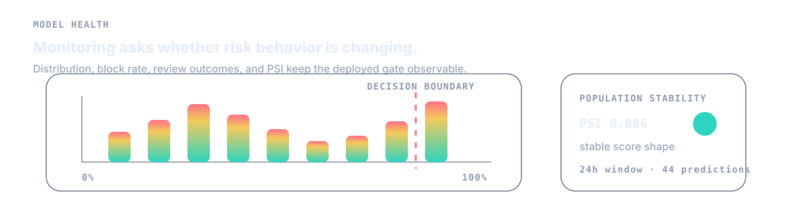

# Sentinel Guard

<p align="center">
  
</p>


Sentinel Guard is a portfolio-grade fraud operations platform that combines
real-time transaction scoring, explainable ensemble decisions, human review,
model monitoring, and tamper-evident compliance records.

<p align="center">
  <a href="https://sentinel-guard-app.vercel.app/"><strong>Live application</strong></a>
  ·
  <a href="./backend/data/MODEL_CARD.md"><strong>Model card</strong></a>
</p>


The project is designed around two authenticated roles:

- **Analyst** — investigates assigned blocked transactions and submits an
  evidence-backed recommendation.
- **Administrator** — assigns cases, records the final verdict, monitors the
  model and review operation, verifies the audit chain, and manages access.

> Sentinel Guard uses synthetic data and demonstration policy fixtures. It is
> not approved for real payment authorization, regulatory filing, or legal
> decision-making.

## Architecture

The application is built around one continuous decision path: live transaction
events enter the risk engine, the ensemble produces an explainable decision,
blocked cases move through human review, and generated reports are preserved in
a hash-linked audit ledger.

The transaction response path performs feature hydration, model inference,
SHAP explanation, persistence, review-case creation, and WebSocket delivery.
Blocked transactions create durable report jobs. A single in-process dispatcher
claims ready jobs, runs the LangGraph compliance pipeline, calls Groq for the
structured memorandum, retries failed jobs, and appends successful reports to
the audit vault.

## Main capabilities

- JWT authentication with analyst and administrator authorization
- Public analyst registration and separately provisioned administrator access
- XGBoost and LightGBM probability ensemble with calibrated decision threshold
- Stateful velocity, device/card, merchant, and off-hours features
- Separate per-model SHAP evidence
- Authenticated live transaction delivery over WebSocket
- Durable audit jobs with retry and interrupted-job recovery
- Structured compliance memoranda generated through LangGraph and Groq
- Downloadable Markdown reports
- Analyst recommendation and administrator final-decision workflow
- Optimistic case versioning to prevent stale updates
- Database-enforced append-only review history
- SHA-256 linked audit records with chain verification
- Prediction, review, latency, block-rate, and PSI monitoring
- UTC timestamps as the canonical audit timeline
- Seeded, role-specific portfolio demonstration mode
- Vercel-hosted frontend with a Railway-hosted backend API

<p align="center">
  
</p>

<p align="center">
  
</p>

## Runtime stack

| Layer | Technology |
| --- | --- |
| Frontend | React, Vite, Vercel |
| API and WebSocket | FastAPI, Gunicorn, Uvicorn worker |
| Backend host | Railway |
| Persistence | SQLite WAL |
| Classification | XGBoost, LightGBM |
| Explainability | SHAP |
| Report workflow | LangGraph |
| Memo generation | Groq, `llama-3.1-8b-instant` |
| Auth | JWT, Argon2 password hashing |

## Model assets

The small inference artifacts and synthetic knowledge fixtures required for a
reproducible clone are versioned under `backend/data/`. Generated datasets and
runtime databases are excluded from Git.

The backend loads `xgb_compliance_gate.json`, `lgb_compliance_gate.txt`, and
`model_config.json` at startup. Detailed model scope, evaluation results, and
limitations are documented in
[`backend/data/MODEL_CARD.md`](backend/data/MODEL_CARD.md).

## Production deployment

The public build is split across two services:

- Frontend: Vercel serves the Vite React application.
- Backend: Railway runs the FastAPI service with Gunicorn and one Uvicorn
  worker.

The frontend production environment points directly at the Railway backend:

```env
VITE_API_BASE_URL=https://sentinel-guard-backend.up.railway.app/api/v1
VITE_WS_URL=wss://sentinel-guard-backend.up.railway.app/ws/live-feed
```

The backend requires:

```env
JWT_SECRET_KEY=...
GROQ_API_KEY=...
DEMO_MODE=true
```

SQLite is used with WAL mode. The current backend process owns audit-job
dispatch, WebSocket fan-out, and report generation, so production is designed
for a single backend worker while this storage model is in use.

## Local development

### Backend

```bash
cd backend
python -m venv venv
source venv/bin/activate
pip install -r requirements.txt
cat > .env <<'EOF'
JWT_SECRET_KEY=local-development-secret-with-at-least-32-characters
GROQ_API_KEY=your-groq-api-key
DEMO_MODE=true
EOF
uvicorn app.main:app --host 127.0.0.1 --port 8000
```

The backend initializes the SQLite schema on startup and stores the runtime
database under `backend/data/sentinel_storage.db` unless
`SENTINEL_DATABASE_PATH` is set.

### Frontend

```bash
cd frontend
npm ci
npm run dev
```

The Vite development server proxies API and WebSocket traffic to
`127.0.0.1:8000`.

## Tests

```bash
cd backend
JWT_SECRET_KEY=test-only-secret-key-with-at-least-32-characters \
DEMO_MODE=true \
venv/bin/python -m unittest discover -s tests -p 'test_*.py'
```

```bash
cd frontend
npm test -- --run
npm run build
```

## Deployment notes

For a production environment beyond the portfolio sandbox:

- Run the backend as exactly one worker while SQLite and the in-process audit
  dispatcher are used.
- Attach persistent storage for the SQLite database.
- Set `GROQ_API_KEY` on the backend host; never expose it to the frontend.
- Use HTTPS and WSS at the public edge.
- Keep `DEMO_MODE=false` outside the public demo environment.

Horizontal backend scaling requires moving the database to a shared server
database and coordinating report jobs and WebSocket fan-out through shared
infrastructure such as Redis.

## Built by

Sentinel Guard was designed and built by
[Richa Gupta](https://www.linkedin.com/in/richa-gupta-cse).
